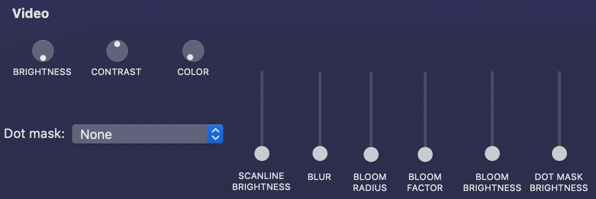
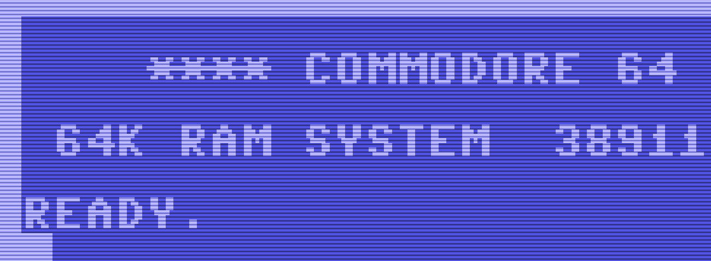
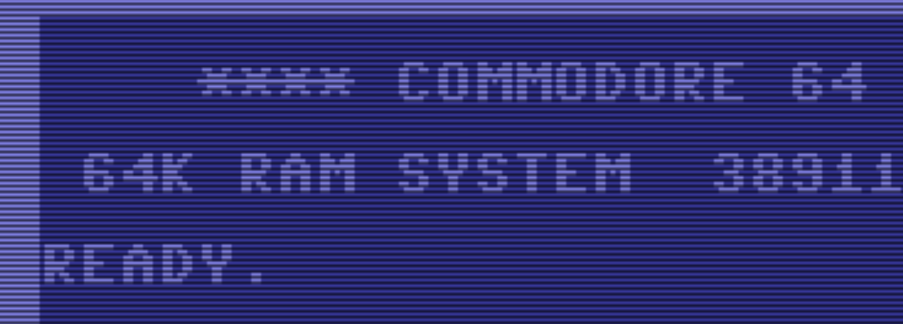
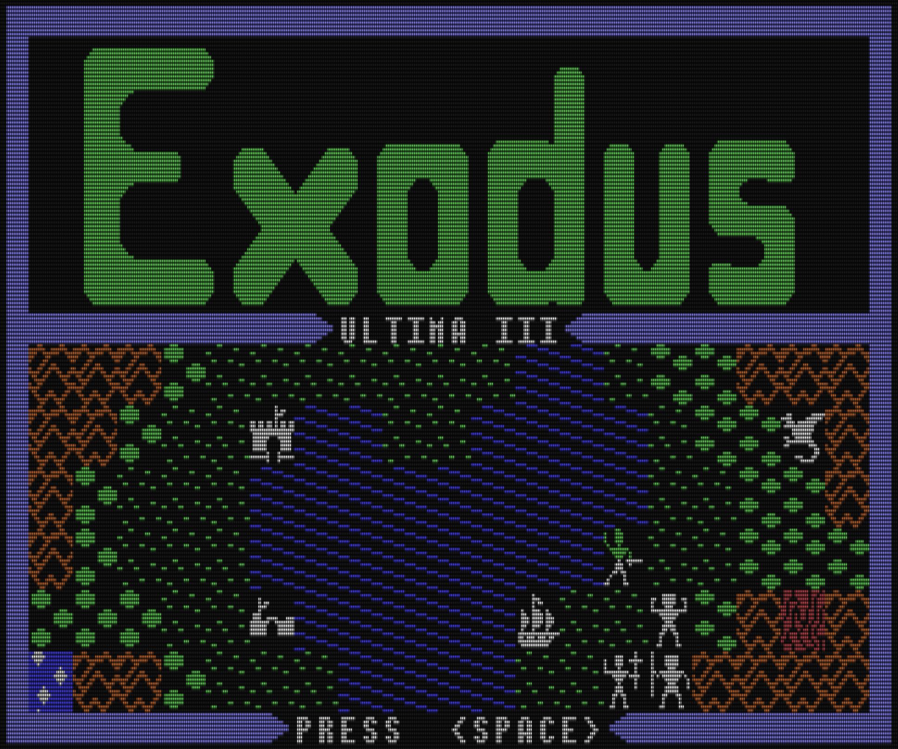

This fork of www.dirkwhoffmann.de/virtualC64 provides alternate video controls which I hope can better emulate CRT monitors:

The first significant difference is in the scanlines. VirtualC64 3.1.1 scanlines:

This fork's scanlines:

The next significant difference is the blooming. For example, here is the Ultima III intro screen with no bloom:

And with bloom:

VirtualC64 is open source and released under the GNU General Public License.
